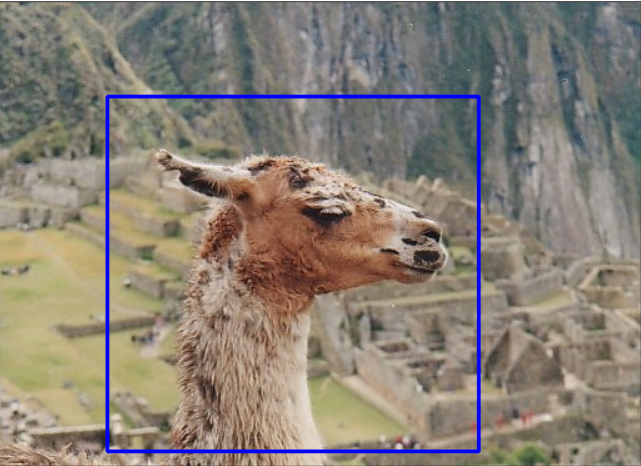
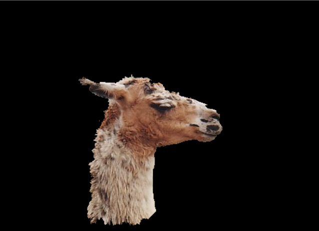

# GrabCut 

An implementation of [GrabCut](https://cvg.ethz.ch/teaching/cvl/2012/grabcut-siggraph04.pdf) in Python.

## Requirements
The following Python Libraries are required
1. Numpy
2. OpenCV
3. Sklearn
4. iGraph
5. Tqdm
6. Matplotlib

## Functions Available
- Box select: Users can select a bounding box for the object.
- Refine Selection: Users can refine their selection by selecting background and foreground pixels
- Refine Output: Users can have the algorithm refine the output by running more iterations
- 4-connectivity or 8-connectivity: Users can decide whether there should be a 4 connectivity graph or an 8 connectivity graph to be cut
- Number of Gaussians: Users can decide the number of Gaussians to fit to the foreground and the background

## How to run
The `src` directory has both the GrabCut algorithm and the EventHandling for user input. The `run` function in `example.ipynb` notebook implements the actual run function. This `run` function can be used for running GrabCut. 

## Example Results

Input Llama | Segmented Output
:-----------:|:---------------:
 | 

Result from 5 iterations of the GrabCut algorithm.

